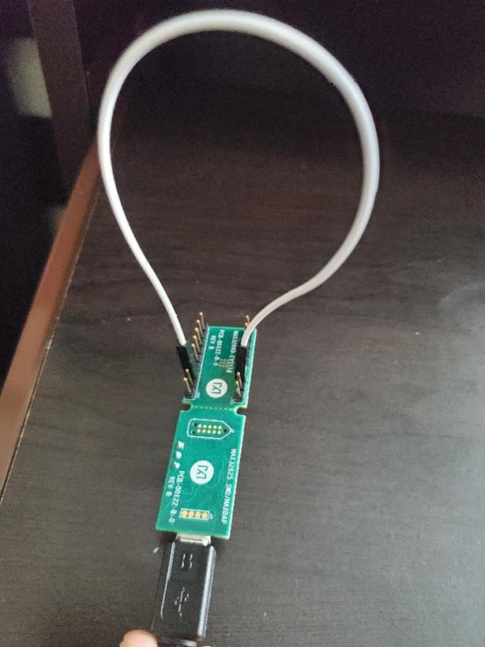

# MAX32660 UART Example
This project is designed to demonstrate how to use UART with Direct Memory Access (DMA)on the MAX32660 microcontroller, specifically, the [evaluation kit]https://www.maximintegrated.com/en/products/microcontrollers/MAX32660-EVSYS.html). It was developed in the Eclipse IDE, Release Neon.3 Version 4.6.0.

You *must* connect P0_4 (TX) to P0_5 (RX) for the example to function correctly.

The example sends data between these two pins in a UART operation that is managed by the DMA
controller, leaving the processor idle while the transaction occurs. 

*Note: The program tested up to 512 bytes of data for the communication, but more data can be sent/received. 

The theoretical limit for a DMA transaction with no reloading is 0xFFFFFF, or 16,777,215 bytes.
This is determined the DMA channel's Count register.

UART Parameters used: 8 bit transactions, No parity, Stop bit enabled, Polarity enabled, Flow control enabled.
Baud: 115200; configurable.

## Creating the project
This project was designed using the Maxim ARM Toolchain in the Eclipse IDE (Release Neon.3 Ver. 4.6.3). In order to run this example, one should create a new project under their workspace in Eclipse. Go to File-->New-->Project and select the “Maxim Microcontrollers” wizard under C/C++. Name the project and select the workspace location, then click “Next”. Set the project configuration as below (the example type is not critical; it just selects a template for the code):

After clicking “Finish”, copy the main.c from the example you want to run (either the Loopback example or the MAX30205 example) and replace the main.c template generated by Eclipse. Connect the hardware as detailed below and select Debug-->Debug Configurations and select your project’s name from the list. The example should debug correctly and, assuming the hardware is properly connected, yield accurate results.

